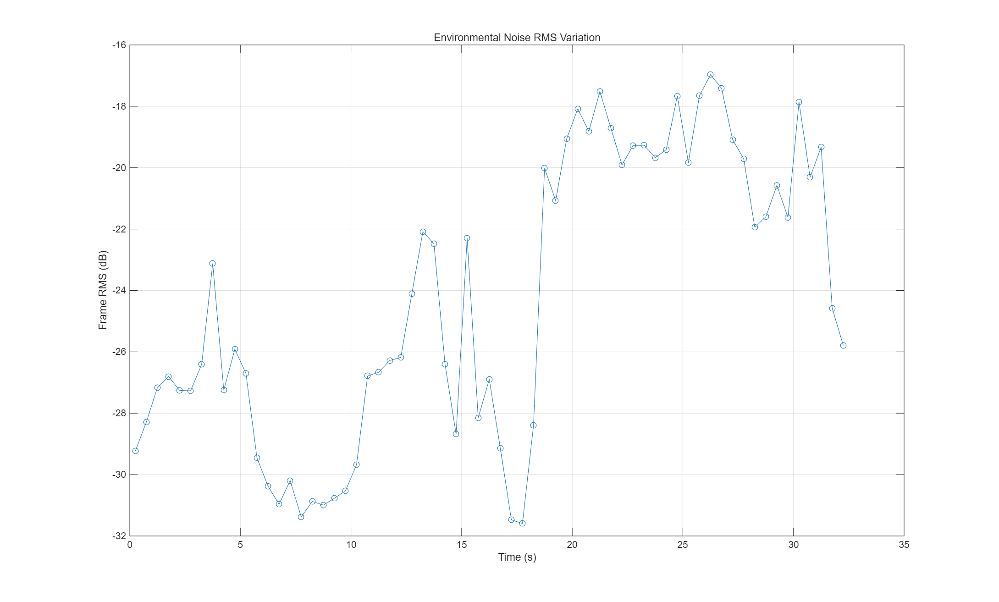
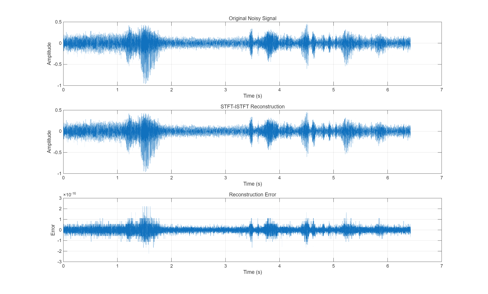
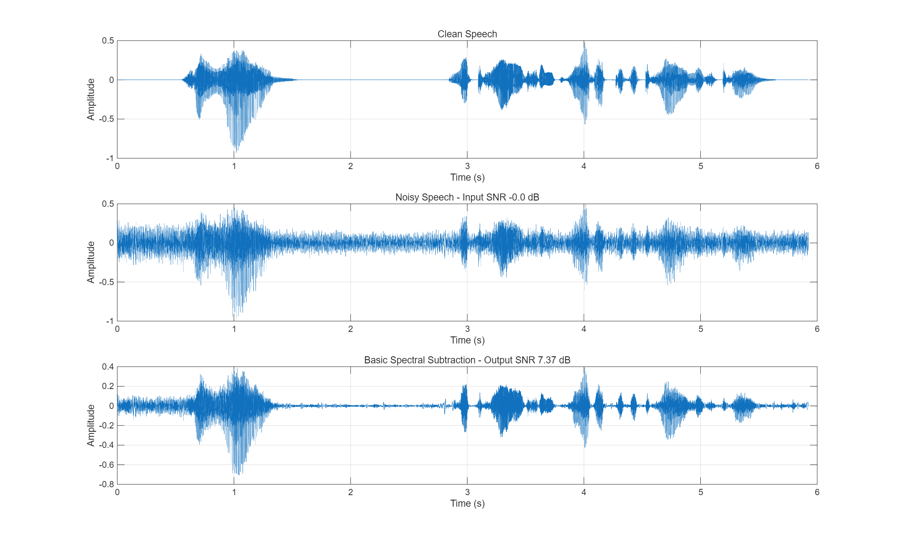

# Beyond SNR: Understanding the Artefacts and Limits of Spectral Subtraction

### A Comparison with Modern Magnitude-and-Phase Speech Enhancement

**ELEC5305 Acoustics, Speech and Signal Processing**

**Student:** Yuanyi Zhang  
**SID:** 550545073  
**GitHub Username:** zyuanyi76-lgtm  

## Project Overview

This project investigates the limitations of classical STFT-based spectral subtraction for speech enhancement.

Rather than asking only how much noise can be removed, the project studies the trade-off between:

- residual background noise;
- desired-speech attenuation;
- musical-noise artefacts;
- speech intelligibility; and
- predicted perceptual quality.

A basic spectral subtraction method will first be implemented as a classical baseline. A modified version using over-subtraction and spectral flooring will then be evaluated across a modest grid of parameter settings.

The project will also include two reference experiments:

1. an oracle clean-phase reconstruction to investigate whether noisy-phase retention limits classical spectral subtraction; and
2. a pretrained MP-SENet model as a modern magnitude-and-phase speech-enhancement reference.

## Main Research Question

When spectral subtraction is made more aggressive, do conventional enhancement metrics correctly reveal the trade-off between residual noise, speech distortion and musical-noise artefacts, and how does this trade-off differ from a modern magnitude-and-phase speech enhancer?

## Secondary Research Question

How much of the remaining error in classical spectral subtraction is caused by magnitude-domain suppression, and how much is associated with retaining the noisy phase?

## Experimental Data

The experiment will use controlled noisy-speech mixtures.

Planned conditions:

- Sampling rate: 16 kHz
- Audio format: mono
- Clean speech: LibriSpeech
- Approximately 16 utterances from multiple speakers
- Noise conditions:
  - white Gaussian noise;
  - non-stationary environmental noise from MUSAN
- Input SNR:
  - 0 dB;
  - 5 dB;
  - 10 dB
- Development and test speakers will be separated where practical.
- A 0.5-second noise-only segment will be retained for controlled noise estimation.

## Fixed STFT Parameters

The STFT configuration will remain fixed:

- Hann window: 512 samples
- Window duration: 32 ms
- Hop size: 256 samples
- Overlap: 50%
- FFT size: 512
- Sampling rate: 16 kHz

The main experimental variables will remain the spectral-subtraction parameters alpha and beta.

## Method A: Basic Spectral Subtraction

The classical baseline is:

|S_base(m,k)| = max(|Y(m,k)| - |N_hat(k)|, 0)

The noisy phase will be retained during reconstruction.

## Method B: Modified Spectral Subtraction

The modified method is:

|S_mod(m,k)| = max(|Y(m,k)| - alpha|N_hat(k)|, beta|N_hat(k)|)

where:

- alpha controls the strength of over-subtraction;
- beta controls the spectral floor.

A modest alpha-beta grid will be evaluated only on the development set.

Approximately 15-25 parameter combinations will be sufficient.

## Evaluation Metrics

The project will use complementary metrics rather than relying on one SNR value.

### Conventional metrics

- SNR improvement
- STOI

### Modern perceptual metric

DNSMOS P.835:

- SIG: predicted speech-signal quality
- BAK: predicted background-noise quality
- OVRL: predicted overall quality

DNSMOS will be treated as an objective perceptual-quality predictor, not as a replacement for formal human listening tests.

## Speech and Noise Decomposition

Because the clean speech and added noise are known separately, the classical enhancement gain G(m,k) will also be applied separately to:

- clean speech;
- added noise.

This will allow measurement of:

- desired-speech attenuation;
- residual-noise attenuation.

This analysis will help explain why two parameter settings with similar SNR may sound different.

## Musical-Noise Analysis

Musical-noise artefacts will be analysed using:

- residual-noise spectrograms;
- informal listening;
- a simple spectral-kurtosis-change diagnostic.

The kurtosis measure will be treated as a diagnostic rather than a complete perceptual musical-noise metric.

## Diagnostic C: Oracle Clean Phase

The modified spectral-subtraction magnitude will be reconstructed using:

1. the practical noisy phase; and
2. the clean-speech phase.

The clean-phase result is an oracle diagnostic only and is not a practical enhancement method.

It will be used to estimate how much performance is limited by retaining noisy phase.

## Reference D: Pretrained MP-SENet

A released pretrained MP-SENet checkpoint will be used as a fixed modern reference.

MP-SENet estimates both magnitude and phase, making it particularly relevant to the phase-related question in this project.

The model will only be used for inference.

It will not be:

- trained;
- fine-tuned; or
- redesigned.

## Planned Comparison

The final comparison will include:

1. Basic spectral subtraction
2. Modified spectral subtraction
3. Modified magnitude + oracle clean phase
4. Pretrained MP-SENet

The aim is not to beat the neural system.

The aim is to understand how the error structure differs between classical magnitude-only processing and modern magnitude-and-phase enhancement.

## Expected Results and Figures

Planned analyses include:

- alpha-beta trade-off maps;
- SNR, STOI and DNSMOS comparisons;
- residual-noise versus desired-speech attenuation;
- musical-noise spectrogram examples;
- noisy-phase versus oracle clean-phase comparison;
- classical versus pretrained modern enhancement.

## Project Scope

The project will remain deliberately focused.

It will not include:

- Wiener filtering;
- MMSE-STSA;
- multiple neural enhancement systems;
- neural-network training;
- STFT-window optimisation;
- formal subjective listening experiments.

## Progress to Date

The project has completed the initial data preparation, STFT validation, and baseline spectral-subtraction implementation.

### Dataset Preparation

- 12 clean speech utterances from 6 speakers
- 4 utterances used for development
- 8 utterances used for testing
- 16 kHz, mono audio
- Two noise conditions:
  - white Gaussian noise
  - self-recorded non-stationary environmental noise
- Input SNR levels:
  - 0 dB
  - 5 dB
  - 10 dB
- 72 controlled noisy mixtures in total:
  - 24 development mixtures
  - 48 test mixtures

### STFT / ISTFT Validation

The custom STFT and inverse-STFT implementation was validated before applying any enhancement processing.

For one development mixture:

- Reconstruction SNR: 185.07 dB
- Maximum absolute reconstruction error: approximately 2.22 × 10^-16
- Signal length was preserved exactly

This confirms that the STFT/ISTFT processing chain introduces negligible reconstruction error.

### Preliminary Baseline Result

A basic spectral-subtraction method has been implemented using a noise estimate obtained from the initial 0.5-second noise-only segment.

For one environmental-noise example at approximately 0 dB input SNR:

- Input SNR: approximately 0 dB
- Output SNR: 7.37 dB
- SNR improvement: 7.37 dB

The result shows clear noise reduction, although further analysis is required to examine speech distortion and musical-noise artefacts.

## Preliminary Figures

### Environmental Noise Variation

### STFT / ISTFT Reconstruction

### Basic Spectral Subtraction

### Next Steps

The next stages of the project will investigate:

- modified spectral subtraction using over-subtraction and spectral flooring;
- SNR and STOI evaluation;
- perceptual-quality analysis;
- residual-noise and speech-distortion trade-offs;
- phase-related limitations;
- comparison with a pretrained modern speech-enhancement model.
## Project Status

**Current stage:** Revised project design following proposal feedback.

Next steps:

1. implement and validate STFT -> ISTFT reconstruction;
2. implement basic spectral subtraction;
3. implement the alpha-beta development-set sweep;
4. add evaluation metrics;
5. perform artefact and phase analysis;
6. compare with the pretrained MP-SENet reference.
